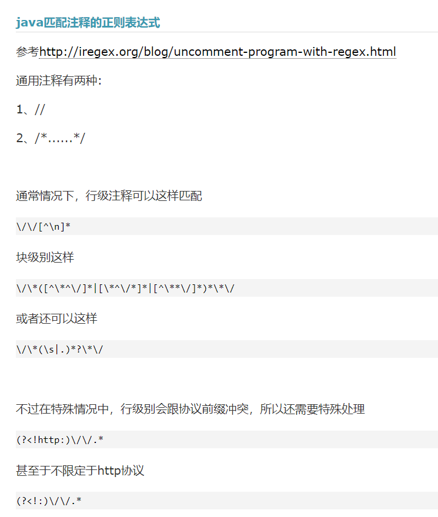

// (//[^\n]*):双斜杠注释
// ((/[*]([*@]|[\n]|\\w|\\d|\\s|[^\\x00-\\xff])+[*]/)):斜杠星注释
// /[*]:Start /*
// [*@]:allow * @
// [\n]:allow new line
// \\w|\\d|\\s:allow word,digit,space
// [^\\x00-\\xff]:allow double bytes characters
// +:([*@]|[\n]|\\w|\\d|\\s|[^\\x00-\\xff]) repeat at least once
// [*]/:end */
java.util.regex.Pattern pattern=Pattern.compile("(//[^\n]*)|((/[*]([*@]|[\n]|\\w|\\d|\\s|[^\\x00-\\xff])+[*]/))");
Matcher matcher=pattern.matcher(content);
boolean isfindTarget=matcher.find();
```
            while(isfindTarget) 
            {
                if(matcher.group(1)!=null) {
                    System.out.println("双斜杠注释：" + ":" + matcher.group(1)+"\n");
                }else if(matcher.group(2)!=null) {
                    System.out.println("斜杠星注释：" + ":" + matcher.group(2)+"\n");
                }
                
                isfindTarget=matcher.find();
            }
        }
}
```

>https://www.cnblogs.com/xiziyin/archive/2012/01/25/2329350.html
```/**
  * 处理注释 groovy代码
  * @param text
  * @return
  */
  def removeComment(text) {
  return text.replaceAll("(?<!:)\\/\\/.*|\\/\\*(\\s|.)*?\\*\\/", "")
   }
```

>https://www.runoob.com/java/java-regular-expressions.html
正则表达式学习

> https://blog.csdn.net/BitcoinR/article/details/120537010
>
### 报错 与多线程有关
Exception in thread "pool-1-thread-2" java.lang.ArrayIndexOutOfBoundsException: arraycopy: last destination index 206 out of bounds for byte[146]
at java.base/java.lang.System.arraycopy(Native Method)
at java.base/java.lang.String.getBytes(String.java:3624)
at java.base/java.lang.AbstractStringBuilder.putStringAt(AbstractStringBuilder.java:1720)
at java.base/java.lang.AbstractStringBuilder.putStringAt(AbstractStringBuilder.java:1724)
at java.base/java.lang.AbstractStringBuilder.append(AbstractStringBuilder.java:583)
at java.base/java.lang.StringBuilder.append(StringBuilder.java:175)
at AnalyseJavaTask.CommentStatus(AnalyseJavaTask.java:128)
at AnalyseJavaTask.run(AnalyseJavaTask.java:30)
at java.base/java.util.concurrent.ThreadPoolExecutor.runWorker(ThreadPoolExecutor.java:1130)
at java.base/java.util.concurrent.ThreadPoolExecutor$Worker.run(ThreadPoolExecutor.java:630)
at java.base/java.lang.Thread.run(Thread.java:831)
